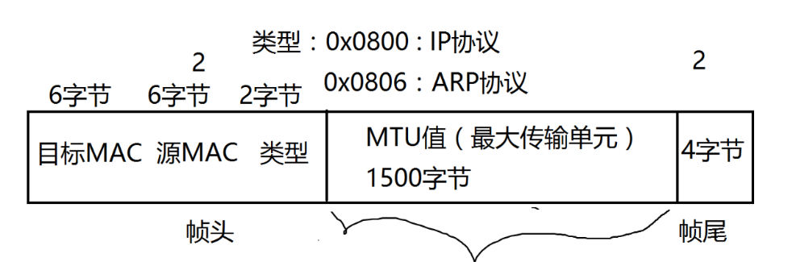
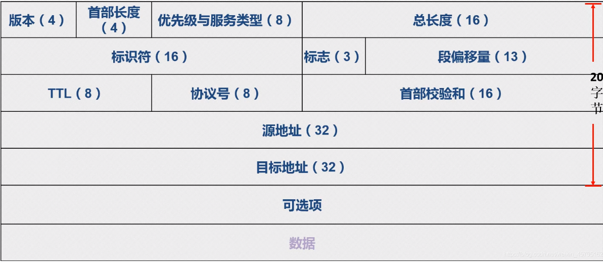
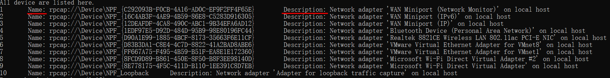
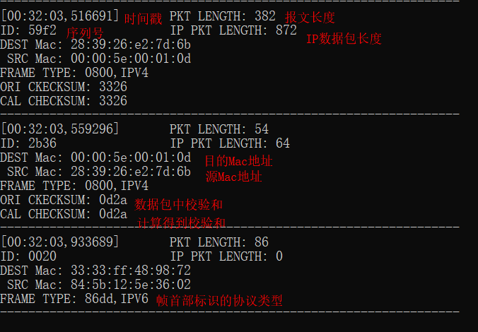
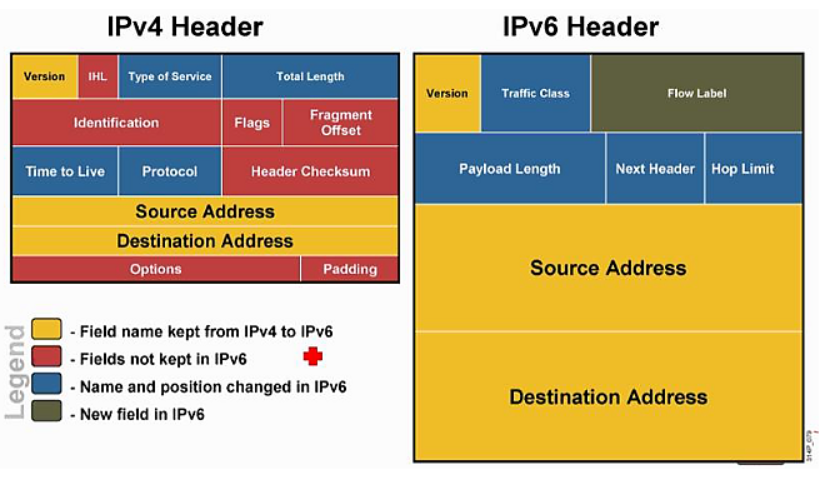

## 实验2：IP数据报捕获与分析（利用NPcap编程捕获数据包）

郭坤昌 2012522 计算机科学与技术

### 要求

1. 了解NPcap的架构。
2. 学习NPcap的设备列表获取方法、网卡设备打开方法，以及数据包捕获方法。
3. 通过NPcap编程，实现本机的IP数据报捕获，显示捕获数据帧的源MAC地址和目的MAC地址，以及类型/长度字段的值。
4. 捕获的数据报不要求硬盘存储，但应以简单明了的方式在屏幕上显示。必显字段包括源MAC地址、目的MAC地址和类型/长度字段的值。
5. 编写的程序应结构清晰，具有较好的可读性。

### 实验过程

#### 声明和定义

变量声明：

```c
pcap_if_t* alldevs; //网卡列表
pcap_if_t* d;   //设备指针
pcap_addr_t* a; //地址
pcap_t* adhandle;   //适配器句柄
struct pcap_pkthdr* header; //数据包头
struct tm ltime;    // 本地时间
time_t local_tv_sec;    // 本地时间
const u_char* pkt_data; // 数据包数据
char errbuf[PCAP_ERRBUF_SIZE];  // 错误信息
char timestr[16];   // 时间字符串
int cnt = 0;    // 网卡计数
int res = 0;    // 捕获数据包计数
int i;  // 作为输入，选中的网卡序号[1-cnt]
```

数据包头结构体：

- 帧结构



- IP数据包结构



根据帧结构和IP数据包结构，如下定义数据包头结构体：

> 数据包中的数据是连续的，因此需要进行字节对齐，使用`#paragma pack(1)`声明，定义完后恢复默认对齐方式

```c
#pragma pack(1) // 进入字节对齐模式
typedef struct FrameHeader
{
    BYTE dstMac[6]; // 目的MAC地址
    BYTE srcMac[6]; // 源MAC地址
    WORD type;      // 类型
};
typedef struct IPHeader
{
    BYTE verLen;
    BYTE tos;
    WORD totalLen;	// IP数据包总长度
    WORD id; // 标识
    WORD flagOffset;
    BYTE ttl;
    BYTE protocol;
    WORD checksum; // 校验和
    DWORD srcIP;	// 目的IP
    DWORD dstIP;	// 源IP
};
typedef struct Data
{
    struct FrameHeader fh;
    struct IPHeader ih;
};
#pragma pack() // 恢复默认对齐方式
```

#### 函数声明

```c
/* 任意进制转十进制 */
int Atoi(string s, int radix);

/* 计算校验和 */
USHORT CheckSum(USHORT* buffer, int size);

/*解析数据包的帧首部和IP首部，得到类型、标识、序列号、校验和等*/
void parse(const u_char* pkt_data);
```

####  获取设备列表

使用`pcap_findalldevs_ex`函数获取设备列表。函数原型和参数含义为：

```c
int pcap_findalldevs_ex(
    char *source, // 获取列表的来源，希望获取本机网络接口时使用PCAP_SRC_IF_STRING
    struct pcap_rmtauth *auth, 	// 获取远程设备网络接口列表时，如果需要认证则需要使用，此实验中为NULL即可
    pcap_if_t **alldevs,	// 函数返回后指向设备列表的第一个元素（类型为pcap_if_t）
    char *errbuf  // 错误信息返回缓冲区
);
// 调用错误返回-1，成功返回0
```

`struct pcap_if_t`的定义为：

```c
struct pcap_if {
    struct pcap_if *next;
    char *name;        /* name to hand to "pcap_open_live()" */
    char *description;    /* textual description of interface, or NULL */
    struct pcap_addr *addresses;
    bpf_u_int32 flags;    /* PCAP_IF_ interface flags */
};
```

获取设备列表：

```c
if (pcap_findalldevs_ex(PCAP_SRC_IF_STRING, NULL, &alldevs, errbuf) == -1)
{
    fprintf(stderr, "Error in pcap_findalldevs_ex: %s", errbuf);
    exit(1);
}
```

显示结果为：



#### 打开对应网卡

打开网络接口可以使用`pcap_open`函数，原型为

```c
pcap_t* pcap_open(
    const char* source, // 打开网卡设备的名字
    int snaplen, // 获取网络数据包的最大长度，最大为65536
    int flags, // 打开网卡的模式，PCAP_OPENFLAG_PROMISCUOUS表示混杂模式，捕获所有流经该网卡的数据包 
    int read_timeout, // 捕获数据包的等待时间，若使用pcap_next_ex()没有捕获到数据包，则返回0
    struct pcap_rmtauth* auth, 
    char* errbuf
);
// 调用出错时返回NULL
```

选择本机网卡，设置获取网络数据包的最大长度，等待时间为1s，以混合模式打开网卡，获得句柄管理打开的网卡

```c
if ((adhandle = pcap_open(d->name, 65536, PCAP_OPENFLAG_PROMISCUOUS, 1000, NULL, errbuf)) == NULL)
{
    fprintf(stderr, "Unable to open the adapter. %s is not supported by WinPcap\n", d->name);
    /* 释放网卡列表 */
    pcap_freealldevs(alldevs);
    return -1;
}
```

#### 捕获并解析数据包

使用函数`pcap_next_ex`捕获数据包。原型为：

```c
int pcap_next_ex(
    pcap_t* p, 	// 已打开的设备
    struct pcap_pkthdr** pkt_header,	// 报文头
    const u_char** pkt_data	// 报文内容
);
// 成功返回1，超时返回0，发生错误返回-1，获取到离线记录的最后一个报文返回-2
```

其中，报文头对应的结构体`pcap_pkthdr`

```c
struct pcap_pkthdr
{
      struct timeval ts;   //ts是一个结构struct timeval，它有两个部分，第一部分是1900开始以来的秒数，第二部分是当前秒之后的毫秒数
      bpf_u_int32 caplen;  //表示抓到的数据长度
      bpf_u_int32 len;     //表示数据包的实际长度

}
```

捕获数据包，并打印时间、报头长度，并进一步解析帧的类型、IP数据包中的信息。

```c
while ((res = pcap_next_ex(adhandle, &header, &pkt_data)) >= 0)
{
    if (res == 0)
        continue; /* 超时继续 */

    /* 打印时间 */
    local_tv_sec = header->ts.tv_sec;
    localtime_s(&ltime, &local_tv_sec);
    strftime(timestr, sizeof timestr, "%H:%M:%S", &ltime);
    printf("[%s,%.6ld]\t", timestr, header->ts.tv_usec);

	/* 打印报头长度 */
    printf("HEADER LENGTH: %d\n", header->len);

    /* 解析数据包并打印相关信息 */
    parse(pkt_data);
    printf("\n-----------------------------------------------------------------\n");
}

```

分析过程在于根据数据包首部各部分定义，获取所需的信息，具体解析过程为：

```c
void parse(const u_char* pkt_data)
{
    struct Data* data = (struct Data*)pkt_data;
    /* 打印序列号 */
    printf("ID: % 04x\t\t", ntohs(data->ih.id));

    /* 打印IP数据包长度 */
    printf("IP PKT LENGTH: %d\n", Atoi(to_string(ntohs(data->ih.totalLen)), 16));

    /* 打印目的Mac地址和源Mac地址 */
    printf("DEST Mac: %02x:%02x:%02x:%02x:%02x:%02x\n SRC Mac: %02x:%02x:%02x:%02x:%02x:%02x\n", data->fh.dstMac[0], data->fh.dstMac[1], data->fh.dstMac[2], data->fh.dstMac[3], data->fh.dstMac[4], data->fh.dstMac[5], data->fh.srcMac[0], data->fh.srcMac[1], data->fh.srcMac[2], data->fh.srcMac[3], data->fh.srcMac[4], data->fh.srcMac[5]);

    /* 打印帧类型 */
    printf("FRAME TYPE: %04x,", ntohs(data->fh.type));
    switch (ntohs(data->fh.type))
    {
    case 0x0800:
        printf("IPV4\n");
        /* 打印校验和 */
        printf("ORI CKECKSUM: %04x\n", ntohs(data->ih.checksum));
        /* 打印计算得到的校验和 */
        data->ih.checksum = 0;
        printf("CAL CHECKSUM: %04x", ntohs(CheckSum((USHORT*)&data->ih, 20)));
        break;
    case 0x86dd:
        printf("IPV6");
        break;
    case 0x0806:
        printf("ARP ");
        break;
    case 0x8035:
        printf("RARP");
        break;
    default:
        printf("OTHER TYPE");
        break;
    }
}
```

计算校验和，需要首先将IP数据包首部中的校验和置0，计算方法为：

```c
USHORT CheckSum(USHORT* buffer, int size)
{
    unsigned long cksum = 0;
    while (size > 1)
    {
        cksum += *buffer++;
        size -= sizeof(USHORT);
    }
    if (size)
    {
        cksum += *(UCHAR*)buffer;
    }
    cksum = (cksum >> 16) + (cksum & 0xffff);  //将高16bit与低16bit相加
    cksum += (cksum >> 16);
    return (USHORT)(~cksum);
}
```

需要注意的是，数据在网络是大端表示，而在本地计算机（x86架构）中是小端表示，因此需要使用`ntos`函数将网络中的数据以小端表示。

显示结果为：



### 实验中遇到的问题

- 数据包头的格式与报文的协议类型有关。

  

因此实验中预设定的包头结构体只对IPv4数据包进行解析是有效的。