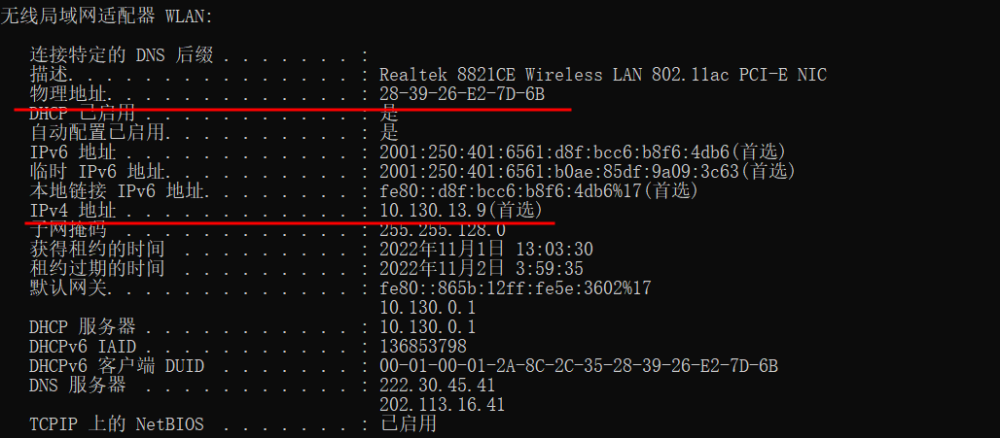
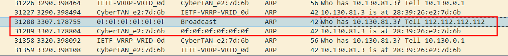
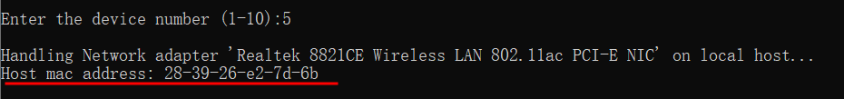
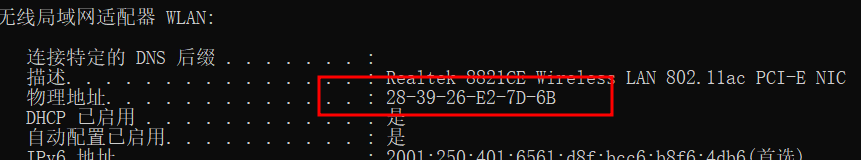
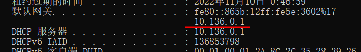
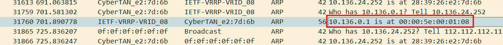
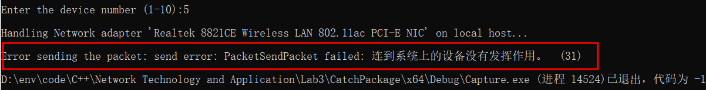
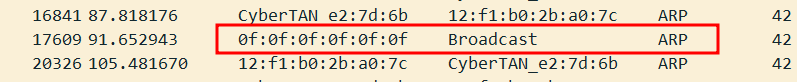
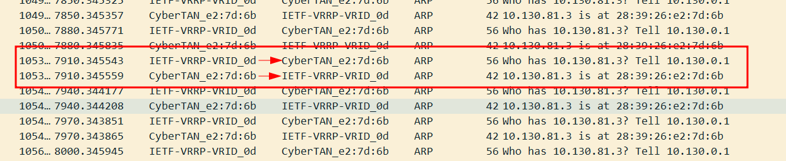

# 实验3：通过编程获取IP地址与MAC地址的对应关系

郭坤昌 2012522 计算机科学与技术

## 要求

通过编程获取IP地址与MAC地址的对应关系实验，要求如下

1. 在IP数据报捕获与分析编程实验的基础上，学习WinPcap的数据包发送方法
2. 通过Npcap编程，获取IP地址与MAC地址的映射关系
3. 程序要具有输入IP地址，显示输入IP地址与获取的MAC地址对应关系界面。界面可以是命令行界面，也可以是图形界面，但应以简单明了的方式在屏幕上显示
4. 编写的程序应结构清晰，具有较好的可读性

## 前期准备

1. 通过课堂学习和教材掌握了IP地址与ARP的基本知识。
2. 利用NPcap编程捕获数据包实验中掌握了以太网数据帧首部、IP数据包结构基础知识，以及NPcap获取设备列表、打开网卡、捕获数据包的方法。
3. 在`cmd`中使用`ipconfig -all`命令查明本机网卡对应IP地址和Mac地址



4. 在`cmd`中使用`arp -a`命令显示高速缓冲区中的`arp`表


## 实验过程

- 构造ARP数据包

ARP数据包需要包括本身的数据结构和在以太网中传输时的数据帧首部，定义如下

```c
#pragma pack(1) // 进入字节对齐模式
typedef struct FrameHeader
{
    BYTE dstMac[6]; // 目的MAC地址
    BYTE srcMac[6]; // 源MAC地址
    WORD type;      // 类型
};
typedef struct ARPPacket
{
	WORD hardwareType;  // 硬件类型
	WORD protocolType;  //  协议类型
	BYTE hLen;  //  硬件地址长度
	BYTE pLen;  //  协议地址长度
	WORD operation; //  操作类型
	BYTE sendHa[6]; //  发送端硬件地址
	DWORD sendIP;   //  发送端IP地址
	BYTE recvHa[6]; //  接收端硬件地址
	DWORD recvIP;   //  接收端IP地址
};
typedef struct ARPData
{
	struct FrameHeader fh;
	struct ARPPacket ap;
};
#pragma pack()
```

构造ARP数据包，需要修改的参数为目的MAC地址，源MAC地址，操作类型，源IP地址，目的IP地址

```c
u_char* makeARPPacket(u_char* dstMac, u_char* srcMac, WORD operation, const char* srcIP, const char* dstIP)
{
    struct ARPData arpData[42];
	// 设置以太网帧的目的Mac地址
	memcpy(arpData->fh.dstMac, dstMac, 6);
	// 设置以太网帧的源Mac地址
	memcpy(arpData->fh.srcMac, srcMac, 6);
	
	// 设置以太网帧的类型为ARP，不修改
	arpData->fh.type = htons(0x0806);
	// 设置ARP数据包硬件类型为以太网，不修改
    arpData->ap.hardwareType = htons(0x0001); 
	// 设置ARP数据包协议类型为IPV4，不修改
	arpData->ap.protocolType = htons(0x0800);
	// 设置ARP数据包硬件地址长度为6，不修改
    arpData->ap.hLen = 6;
	// 设置ARP数据包协议地址长度为4，不修改
    arpData->ap.pLen = 4;
	
	// 设置ARP数据包操作码为ARP请求
	arpData->ap.operation = operation;
	// 设置ARP数据包的源Mac地址
	memcpy(arpData->ap.sendHa, srcMac, 6);
	// 设置ARP数据包的源IP地址
    arpData->ap.sendIP = inet_addr(srcIP);
	// 设置ARP数据包的目的Mac地址
	memcpy(arpData->ap.recvHa, dstMac, 6);   // arp请求中该项没有意义
	// 设置ARP数据包的目的IP地址
    arpData->ap.recvIP = inet_addr(dstIP);
	
	return (u_char*)arpData;
}
```

- 获取打开网卡的MAC地址

思路为使用虚构的MAC地址和IP地址作为发送端，向本机IP发送ARP数据包，捕获本机响应的ARP数据包并进行分析。

```c
/* 构造获取本机MAC的虚构MAC地址的ARP数据包 */
u_char dstMac[6] = BROADCAST_MAC;
u_char srcMac[6] = FAKE_MAC;
char* hostIP = devices[i - 1].ipAddr;   // 打开网卡的IP地址
u_char* broadcastArpData = makeARPPacket(dstMac, srcMac, ARP_REQUEST, FAKE_IP, hostIP); // 向本机发送虚构地址的ARP请求数据包
BYTE hostMac[6];

/* 广播ARP数据包 */
pcap_sendpacket(adhandle, broadcastArpData, 42);

/* 捕获ARP数据包，分析本机MAC地址 */
while ((res = pcap_next_ex(adhandle, &header, &pkt_data)) >= 0)
{
    /* 超时继续 */
    if (res == 0) continue;
    
    /* 分析捕获的唯一符合过滤条件的ARP数据包 */
    struct ARPData* caughtArpData = (struct ARPData*) pkt_data;
    WORD caughtPacketType = ntohs(caughtArpData->fh.type);
    WORD operation = caughtArpData->ap.operation;
    memcpy_s(hostMac, 6, caughtArpData->fh.srcMac, 6);
    if(res==1 && caughtPacketType ==0x0806 && operation==ARP_REPLY)   // 判断捕获的ARP数据包为ARP类型，且为ARP响应
    {
        printf("Host mac address: %02x-%02x-%02x-%02x-%02x-%02x\n", hostMac[0], hostMac[1], hostMac[2], hostMac[3], hostMac[4], hostMac[5]);
        break;
    }
}
if (res == -1)
{
    printf("Error reading the packets: %s\n", pcap_geterr(adhandle));
    exit(-1);
}
```

在Wireshark中捕获的结果如下



在程序中的输出如下，与之前查看的本机MAC地址相同



下图为使用`ipconfig -all`查询得到的本机MAC地址



- 获取远程网卡的MAC地址

思路为填入本机的MAC地址与IP地址作为发送端，目的IP地址为输入的需要查询的IP地址，捕获响应数据包并进行分析。

代码大致与获取本机MAC地址相同，主要修改部分为修改发送端MAC地址与IP地址为本机MAC地址，同时过滤条件增加捕获数据包的源MAC地址不为本机MAC地址，这是因为本地网关和网卡之间会进行定时的ARP请求-应当，以维护保存在网关的ARP表，如果不加以滤过，容易捕获到网卡对网关的响应，获得错误结果。

```c
/* 查询远端网卡 */
memcpy_s(srcMac, 6, hostMac, 6);
broadcastArpData = makeARPPacket(dstMac, srcMac, ARP_REQUEST, hostIP, dstIP);
pcap_sendpacket(adhandle, broadcastArpData, 42);
while ((res = pcap_next_ex(adhandle, &header, &pkt_data)) >= 0)
{
    if (res == 0) continue;
    struct ARPData* caughtArpData = (struct ARPData*)pkt_data;
    WORD caughtPacketType = ntohs(caughtArpData->fh.type);
    BYTE caughtSrcMac[6];
    memcpy_s(caughtSrcMac, 6, caughtArpData->fh.srcMac, 6);
    WORD operation = caughtArpData->ap.operation;
    if (res == 1 && caughtPacketType == 0x0806 && operation == ARP_REPLY && !macCompare(caughtSrcMac, hostMac))   // 判断捕获的ARP数据包为ARP类型，且为ARP响应，且捕获的源MAC地址不为本机MAC地址
    {
        printf("Caught mac address: %02x-%02x-%02x-%02x-%02x-%02x\n", caughtSrcMac[0], caughtSrcMac[1], caughtSrcMac[2], caughtSrcMac[3], caughtSrcMac[4], caughtSrcMac[5]);
        break;
    }
}
if (res == -1)
{
    printf("Error reading the packets: %s\n", pcap_geterr(adhandle));
    exit(-1);
}
```

这里尝试获取网关的MAC地址。



获取到网关对应的MAC地址

通过Wireshark捕获的结果进行验证，MAC地址获取正确。



## 实验中遇到的问题

- 电脑连接无线网卡，并通过广播发送ARP数据包时返回值不为0的问题。

检错流程：

```c
if (pcap_sendpacket(adhandle, arpData, 42) != 0)
    fprintf(stderr, "\nError sending the packet: %s\n", pcap_geterr(adhandle));
else
	printf("ARP packet broadcast.\n");
```

返回信息：

`PacketSendPacket failed: A device attached to the system is not functioning. (31)`



在[npcap发送失败返回错误信息](https://github.com/nmap/npcap/issues/638)中找到了相关解答：

本机安装的`npcap`版本为1.7，而1.7版本可以处理发送失败的情况，发送成功与否与返回值无关，可以理解为发送后返回错误值，数据包在排队等待发送。因此，使用`wireshark`捕获数据包进行验证。



能够正确捕获到发送的数据包。因此更改为如下代码，取消错误检错：

```C
/* 广播ARP数据包 */
pcap_sendpacket(adhandle, arpData, 42);
```

- 获取远端网卡MAC地址时，受本机MAC地址干扰问题

通过`wireshark`捕获结果，看到本地网关和网卡进行定时ARP请求和响应，以维护保存在网关中的ARP表，因此需要在获取远端MAC地址时，对本地MAC地址进行过滤。

