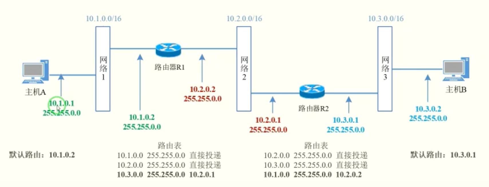
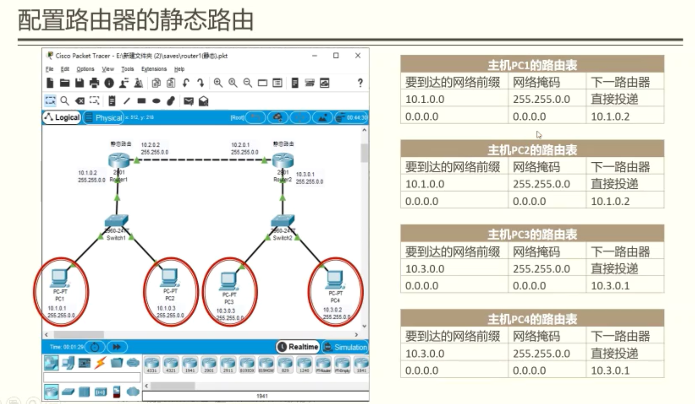
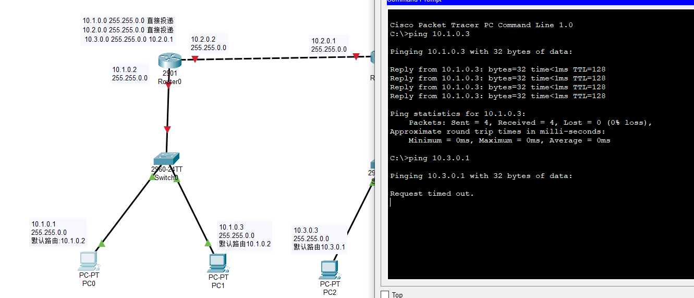
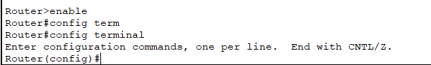

# 实验4：互联网组网与路由器配置

郭坤昌 2012522 计算机科学与技术

## 要求

### 实体环境下互联网组网与路由器配置

在实体环境下完成互联网组网与路由器配置，要求如下：

1. 在机房实验室环境下，通过将局域网划分为不同子网，用多IP主机作为路由器，组建互联网。

2. 在命令行方式下，按照静态路由方式，配置路由器和主机，测试互联网的连通性。

### 仿真环境下的互联网组网与路由器配置

在仿真环境下完成互联网组网与路由器配置，要求如下：

1. 学习路由器的配置方法和配置命令。

2. 参考实体实验，组建由多个路由器组成的互联网。物理网络可以由集线器、交换机构成。

3. 按照静态路由方式配置路由器和主机，测试互联网的连通性。

4. 利用动态路由方式配置路由器和主机，测试互联网的连通性。

5. 在仿真环境的“模拟”方式中观察数据包在互联网中的传递过程，并进行分析。

## 前期准备

主机A：IP地址：192.168.5.1，子网掩码：255.255.255.0，默认路由：192.168.5.2

路由器R1：IP地址1：192.168.5.2，子网掩码：255.255.255.0

​					  IP地址2：192.168.8.2，子网掩码：255.255.255.0

​					  网络号：192.168.13.0，子网掩码：255.255.255.0，路由器：192.168.8.1

路由器R2：IP地址1：192.168.8.1，子网掩码：255.255.255.0

​					  IP地址2：192.168.13.1，子网掩码：255.255.255.0

​					  网络号：192.168.5.0，子网掩码：255.255.255.0，路由器：192.168.8.2

主机B：IP地址：192.168.13.2，子网掩码：255.255.255.0，默认路由：192.168.13.1

    

## 实验过程

添加路由表项

route ADD 100.3.0.0 MASK 255.255.0.0 10.2.0.1

显示路由表项

route PRINT

服务：routing and remote access

测试配置

·Ping命令：测试源主机和目的主机是否可以连通
·Tracert命令：既能测试源主机和目的主机是否可以连通，还能显示数据
报走过的路径

- 需要关闭防火墙

## 实验中遇到的问题

