# 实验5：简单路由器程序的设计

学号 2012522

姓名 郭坤昌

年级 2020

专业 计算机科学与技术

2022 年 12月22日

## 实验内容说明

简单路由器程序设计实验的具体要求为：

（1）设计和实现一个路由器程序，要求完成的路由器程序能和现有的路由器产品（如思科路由器、华为路由器、微软的路由器等）进行协同工作。

（2）程序可以仅实现IP数据报的获取、选路、投递等路由器要求的基本功能。可以忽略分片处理、选项处理、动态路由表生成等功能。

（3）需要给出路由表的手工插入、删除方法。

（4）需要给出路由器的工作日志，显示数据报获取和转发过程。

（5）完成的程序须通过现场测试，并在班（或小组）中展示和报告自己的设计思路、开发和实现过程、测试方法和过程。

## 实验准备

- 网络拓扑图

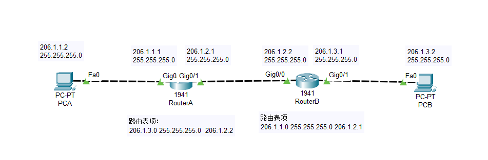

- 虚拟机配置

| 编号 | IP                  | 子网掩码      | 说明    |
| ---- | ------------------- | ------------- | ------- |
| 1    | 206.1.1.2           | 255.255.255.0 | 主机A   |
| 2    | 206.1.1.1,206.1.2.1 | 255.255.255.0 | 路由器A |
| 3    | 206.1.2.2,206.1.3.1 | 255.255.255.0 | 路由器B |
| 4    | 206.1.3.2           | 255.255.255.0 | 主机B   |

其中，1号设备和4号设备为终端设备，2号设备为需要运行路由程序的设备，3号设备为另一台路由器。所有4台设备的P地址已经全部分配好，所有4台设备已经安装好x86的VC++运行时环境。其中3号设备的路由功能已经全部开启，但仍需要每次开机后手动添加路由表项：

`route ADD 206.1.1.0 MASK 255.255.255.0 206.1.2.1`

即开启四台虚拟机以后，需要：

1. 为3号设备手动添加路由表项。

2. 在2号设备上运行路由程序。

环境即搭建完毕。

- 编程环境

使用VC6进行编程和配置

## 实验过程

### 路由器工作流程

路由器使用混杂模式捕获所有经过网卡的数据包，处理基于IP协议的数据包，这里只考虑ICMP报文，在完成前期打开网卡，获取本机mac地址后，工作过程如下：

1. 接收线程——过滤

   1.1 过滤本机发送的数据包-

   1.2 对于ICMP数据包

   - 过滤目的地址为本机IP地址（不需要转发）的数据包
   - 过滤目的mac地址不为本机mac地址的数据包（不经过路由程序的数据包，这里不考虑组播和广播的处理，详见第三节问题处理部分）
   - 过滤校验和字段出错的数据包
   - 将满足条件的ICMP数据包加入缓冲区等待转发

   1.3 对于ARP数据包

   - 过滤ARP请求数据包。原因如下：向本机进行ARP请求的数据包由操作系统自动进行处理；若跨网段进行ARP请求，则不予转发
   - 过滤不在同一网段下的ARP相应数据包。由于使用虚拟机，仍能在混杂模式下捕获到与接口不在同一网段下的ARP响应数据包，这是不合理的，因此还必须进行过滤。
   - 将ARP相应数据包中的源IP地址和源mac地址的映射关系添加到ARP缓存中，并记录添加的时间

2. 转发线程——维护缓冲区，转发数据包

   2.1 遍历转发缓存，对每一个数据包，若TTL为0，丢弃并回传ICMP差错报文，否则进入下一步

   2.2 检查数据包是否超时（缓存清理部分），若未超时进入下一步，否则移出缓冲区

   2.3 检查目的IP地址是否与网卡接口在同一网段，若是，则转发IP为目的IP，进入2.5步，否则进入2.4步

   2.4 在路由表中查找目的IP对应的下一跳地址。由于默认网关的设置，这里一定能有对应路由表项的下一跳地址。

   2.5 在ARP表中查找转发IP对应的mac地址，若存在，则修改数据包以太层的目的mac地址为查找到的mac地址，修改TTL-1，重新计算校验和，进行转发，否则广播ARP请求

3. 缓存清理

   3.1 若数据包超过最长缓存时间，将其移出缓冲区。在转发遍历时实现

   3.2 定时检查ARP缓冲区，若超过了老化时间，则将其删除

4. 指令线程——手动维护路由表和ARP缓存表

   4.1 路由表的增删改

   4.2 ARP表的查询

### 详细代码

#### 获取设备信息并打开

程序运行在具有双网卡的虚拟机设备上，在打开网卡后，需要频繁使用打开设备的两个IP地址和对应的子网掩码，以及打开网卡的句柄，因此这里使用`Device`类管理设备信息，使用`DeviceManager`类管理设备。主要成员变量及方法如下：

```c++
class Device {
private:
    string name;
    string description;
    DWORD ip[2];
    DWORD subnetMask[2];
    BYTE mac[6];
    friend class DeviceManager;
};
class DeviceManager {
private:
    u_int deviceNum;
    Device *deviceList;		// 设备列表
    Device *openDevice;		// 打开设备指针
    pcap_t *openHandle;		// 打开设备句柄
public:
    void findDevices();     // 查找所有网卡,获取设备信息
    void selDevice();       // 选择并打开网卡
    void setMac(BYTE *mac, Device *device);   // 设置特定设备MAC地址
    DWORD findItf(DWORD ip);// 根据IP地址，查看是否与打开设备在同一网段，并返回对应接口IP地址
};
```

获取设备名和描述；遍历`pcap_addr_t`链表，获取设备的IP的子网掩码。

```c++
void DeviceManager::findDevices() {
    ...
    deviceList = new Device[deviceNum];
    for (i = 0, d = alldevs; d != NULL; d = d->next, i++) {
        deviceList[i].name = string(d->name);	 // 获取设备名
        deviceList[i].description = string(d->description);	// 获取设备描述
        for (j = 0, a = d->addresses; j < 2 && a != NULL; a = a->next) {    // 获取设备IP地址和子网掩码
            if (a->addr->sa_family == AF_INET) {
                deviceList[i].ip[j] = inet_addr(inet_ntoa(((struct sockaddr_in *) a->addr)->sin_addr));
                deviceList[i].subnetMask[j] = inet_addr(inet_ntoa(((struct sockaddr_in *) a->netmask)->sin_addr));
                j++;
            }
        }
    }
	...
}
```

输入设备序号，选中并打开设备，同时将打开设备指针指向打开设备的信息。

```c++
void DeviceManager::selDevice() {
	...
    openDevice = &deviceList[i];
    if ((openHandle = pcap_open(openDevice->name.c_str(), 65536, PCAP_OPENFLAG_PROMISCUOUS, 1000, NULL, errbuf)) == NULL) ...
}
```

该虚拟机仅有一个网卡，获取信息并打印如下：

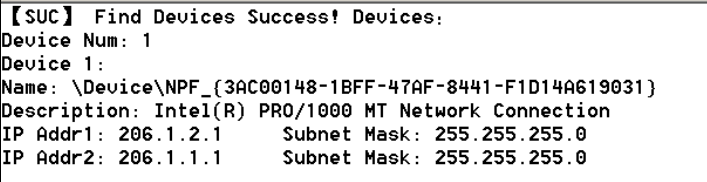

#### 获取设备mac地址

实验中需要获取本机mac地址和其他主机的mac地址，用以进行包过滤和数据包转发。获取本机mac地址和其他主机mac地址的策略不同：

1. 获取本机mac地址：使用虚构的源IP地址与全0的源mac地址，以本机双IP中任一IP为目的IP，广播ARP请求。设置包过滤条件：捕获包源IP为广播包目的IP，捕获包目的IP为虚构IP、目的mac地址为全0。该数据包的源mac地址即为本机IP对应的mac地址。
2. 获取其他主机的mac地址：首先检查目标主机IP地址是否与打开网卡的双接口在同一网段，若不是，则无法获取。从本机mac地址和与目的IP所处同一网段的接口IP地址广播ARP请求。在数据包捕获线程中，解析ARP响应数据包，将IP与mac地址映射关系加入ARP缓存中。包过滤规则接下来详细介绍。

获取本机网络mac地址运行结果：

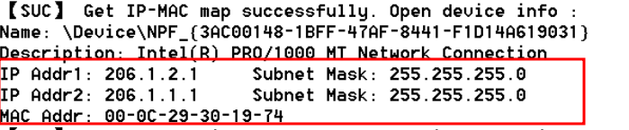

获取其他主机mac地址运行结果：

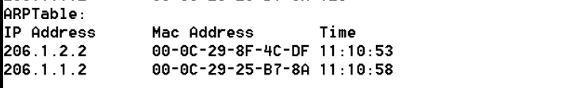

#### 路由表和ARP缓存数据结构

路由表和ARP缓存使用双向链表进行维护，实现其增删查的功能。以下以路由表为例详细介绍。路由表项和路由表数据结构如下：

```c++
class RoutingEntry {
private:
    DWORD dest;         // 目的地址
    DWORD netmask;      // 子网掩码
    DWORD gw;           // 网关地址
    DWORD itf;          // 出接口
    RoutingEntry *prev;
    RoutingEntry *next;
    friend class RoutingTable;
};
class RoutingTable {
private:
    Device *openDevice;
    RoutingEntry *head;
    RoutingEntry *tail;
    u_int size;
public:
    RoutingTable(Device *openDevice);
    void add(DWORD dest, DWORD netmask, DWORD gw);
    void del(RoutingEntry *routingEntry);
    RoutingEntry *lookup(DWORD dest);
    RoutingEntry *lookup(char *dest);
};
```

路由表的添加。首先检查路由表项是否存在，避免重复添加。接着检查添加的下一跳地址是否为本地接口可达（即与打开设备的接口在同一网段），以此设定接口地址（接口字段其实没有发挥作用，但仍然表示该接口对网关的可达性），并最终将表项添加到路由表中。

```c++
void RoutingTable::add(DWORD dest, DWORD netmask, DWORD gw) {
    RoutingEntry *routingEntry;
    DWORD itf;

    // 避免重复添加
    if((routingEntry = lookup(dest)) != NULL && (routingEntry->netmask != 0)) {
        return;
    }
    switch(netmask) {
    case 0:
        // 子网掩码为0，添加默认路由，检查接口到下一跳地址的可达性
        if ((openDevice->getIP(0) & openDevice->getSubnetMask(0)) == (gw & openDevice->getSubnetMask(0))) {
            itf = openDevice->getIP(0);
        } else if ((openDevice->getIP(1) & openDevice->getSubnetMask(1)) == (gw & openDevice->getSubnetMask(1))) {
            itf = openDevice->getIP(1);
        } else {
            return;
        }
        routingEntry = new RoutingEntry(0, 0, gw, itf);
        break;
    default:
        // 检查接口到下一跳地址的可达性
        if ((openDevice->getIP(0) & openDevice->getSubnetMask(0)) == (gw & openDevice->getSubnetMask(0))) {
            itf = openDevice->getIP(0);
        } else if ((openDevice->getIP(1) & openDevice->getSubnetMask(1)) == (gw & openDevice->getSubnetMask(1))) {
            itf = openDevice->getIP(1);
        } else {
            return;
        }
        routingEntry = new RoutingEntry(dest&netmask, netmask, gw, itf);
    }

    if (head == NULL) {
        head = tail = routingEntry;
    } else {
        tail->next = routingEntry;
        routingEntry->prev = tail;
        tail = routingEntry;
    }
    size++;
}
```

路由表添加的添加演示：

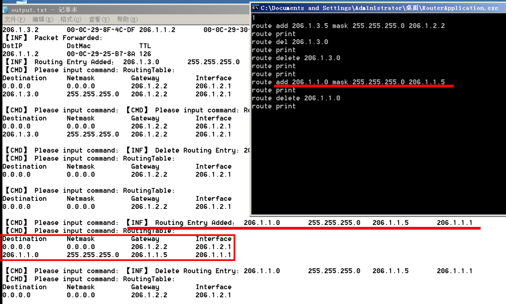

路由表的删除。删除时需要维护双向链表的结构。默认路由不能删除，在上层输入删除路由表项指令时，检查子网掩码，若子网掩码为0，则不能删除。

```c++
void RoutingTable::del(RoutingEntry *routingEntry) {
    if (routingEntry->prev == NULL) {
        head = routingEntry->next;
    } else {
        routingEntry->prev->next = routingEntry->next;
    }
    if (routingEntry->next == NULL) {
        tail = routingEntry->prev;
    } else {
        routingEntry->next->prev = routingEntry->prev;
    }
    delete routingEntry;
    size--;
}
```

路由表的删除演示：

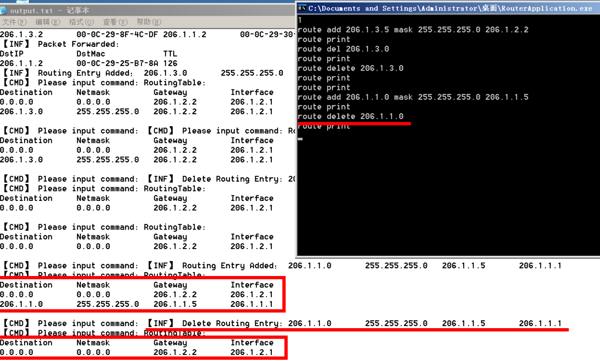

路由表的查找。从头指针依次向后查找，维护一个始终指向匹配目的地址的最长子网掩码。将要查找的地址与表项的下一跳地址进行与运算，比较结果与目的网络，若相等，则进一步比较子网掩码长度，始终维护最长子网掩码的表项作为待返回的候选者。遍历完后，返回指向最长表项的候选者。

```c++
RoutingEntry *RoutingTable::lookup(DWORD dest) {
    RoutingEntry *routingEntry;
    RoutingEntry *candidate;
    DWORD maxPrefixNetmask;

    routingEntry = head;
    if (routingEntry == NULL) {
        cout << "【ERR】 Look up Routing Table Error: Routing table is empty." << endl;
        return NULL;
    }
    candidate = NULL;
    maxPrefixNetmask = head->netmask;
    while (routingEntry != NULL) {
        if ((routingEntry->dest & routingEntry->netmask) == (dest & routingEntry->netmask)) {
            if (ntohl(routingEntry->netmask) > ntohl(maxPrefixNetmask)) { // little endian in network
                maxPrefixNetmask = routingEntry->netmask;
                candidate = routingEntry;
            }
            candidate = routingEntry;
        }
        routingEntry = routingEntry->next;
    }
    if (candidate == NULL) {
        cout << "【ERR】 Look up Routing Table Error: Routing entry not found." << endl;
    }
    return candidate;
}
```

路由表的输出。依次显示目的网路地址、子网掩码、下一跳地址、接口地址

```c++
string RoutingEntry::toStr(bool showAttr) {
    string str = "";
    string temp;
    if (showAttr) {
        str += "Destination     Netmask         Gateway         Interface\n";
    }         //255.255.255.255 255.255.255.255 255.255.255.255 255.255.255.255
    temp = b2s(this->dest);  temp.resize(16, ' ');  str += temp;
	temp = b2s(this->netmask);  temp.resize(16, ' ');  str += temp;
	temp = b2s(this->gw);  temp.resize(16, ' ');  str += temp;
	temp = b2s(this->itf);  str += temp;
    return str;
}
```

#### 数据包捕获线程——过滤数据包

本实验暂时仅考虑ICMP echo request和reply类型数据包的获取并转发，因此对ARP数据包和ICMP数据包设置如下的包过滤条件和后续操作：

1. 过滤本机发送的数据包。若源mac地址为本机mac地址，则不用处理
2. 对于ICMP数据包。过滤目的IP地址为本机IP地址的数据包，过滤mac地址不为本机mac地址的数据包（忽略组播和广播），过滤校验和字段出错的数据包。将满足条件的数据包加入缓冲区等待转发线程进行转发
3. 对于ARP响应数据包，若本地可达，则将源IP地址和源MAC地址加入ARP缓存

```c++
DWORD WINAPI Router::rcvThrd(LPVOID lpParam) {
    ...
    while ((res = pcap_next_ex(router->getDeviceManager()->getOpenHandle(), &header, &pktData)) >= 0) {
        if (res == 0) continue;
        if (macCmp(router->getDeviceManager()->getOpenDevice()->getMac(), ((EthHeader*)pktData)->srcMac)) // 如果是本机发出的数据包则丢弃
            continue;
        switch (ntohs(((EthHeader *)pktData)->type)) {
        case 0x0806:
            if ((ntohs(((ARPPkt *)pktData)->ad.op) == 0x0001)// 如果是ARP请求
            || router->getDeviceManager()->findItf(((ARPPkt *)pktData)->ad.srcIP) == 0)// 或者不与本机接口在同一网段，即不可达的情况，则丢弃
                continue;                                                                        
            router->getARPTable()->add(((ARPPkt *)pktData)->ad.srcIP, ((ARPPkt *)pktData)->ad.srcMac); // 添加ARP表项
            break;
        case 0x0800:
            if (((IPPkt *)pktData)->ih.dstIP == router->getDeviceManager()->getOpenDevice()->getIP(0)        // 如果目的IP为本机IP
             || ((IPPkt *)pktData)->ih.dstIP == router->getDeviceManager()->getOpenDevice()->getIP(1)
             || !macCmp(router->getDeviceManager()->getOpenDevice()->getMac(), ((EthHeader*)pktData)->dstMac) // 或目的MAC不为本机
             || isICMPCorrupted((u_short*)pktData, sizeof(ICMPPingPkt)))                             // 或ICMP校验和错误
                continue;                                                                                                // 丢弃
            EnterCriticalSection(&router->getCS());
            router->getPktBuf()->addBefore((ICMPPingPkt *)pktData);
            cout << recvLog(((ICMPPingPkt *)pktData)->ih.srcIP, ((ICMPPingPkt *)pktData)->eh.srcMac, ((ICMPPingPkt *)pktData)->ih.dstIP, ((ICMPPingPkt *)pktData)->eh.dstMac, (int)((ICMPPingPkt *)pktData)->ih.ttl) << endl;
            LeaveCriticalSection(&router->getCS());
            break;        }
    }
	...
}
```

#### 缓冲区维护线程——处理ICMP数据包

缓冲区维护即转发线程，是实验中最为关键的部分。其基本思路为：遍历接收缓存，将所有需要移除的数据包移除，对剩余数据包进行尝试转发操作，数据包的移除状态也在此进行设定。接收线程和转发线程对缓冲区数据一致性的维护详见实验问题部分。

```c++
DWORD WINAPI Router::fwdThrd(LPVOID lpParam)
{
    ...
    while(true) {
        EnterCriticalSection(&router->getCS());
        pkt = router->getPktBuf()->getHead();
        while(pkt != NULL) {
            if(pkt->shouldDiscard()) {
                pkt = router->getPktBuf()->del(pkt);
            }
            else {
                pkt = pkt->getNext();
            }
        }
        pkt = router->getPktBuf()->getHead();
        if(pkt == NULL) {
            LeaveCriticalSection(&router->getCS());
            continue;
        }
        router->tryToFwd(router->getPktBuf()->getHead());
        pkt = pkt->getNext();
        LeaveCriticalSection(&router->getCS());
        while(pkt != NULL) {
            router->tryToFwd(pkt);
            pkt = pkt->getNext();
        }
    }
}
```

尝试转发过程即对数据包的状态进行一系列检查，确认其是否可以转发，并获取下一跳mac地址或目的mac地址，进行转发。若数据包的生存期为0，设置其状态为可移除，直接返回；若在缓冲区中的时间超过最长允许时间，设置其状态为可移除，直接返回；若数据包的目的IP地址是打开设备本地可达的，则在ARP缓存中查找目的IP对应的mac地址。若找到则需要设置TTL-1，重新计算校验和，进行转发，否则广播对该IP地址的ARP请求。若数据包不是本地可达的，则查找路由表。在本实验中，由于除了路由器A，仅有一个路由器B，因此将默认路由设置为B，这样查找路由一定可以有表项返回。检查表项对应下一跳地址是否存在mac映射。若找到则需要设置TTL-1，重新计算校验和，进行转发，否则广播对该IP地址的ARP请求。

```c++
void Router::tryToFwd(Packet* pkt) {
    if (pkt->getICMPPingPkt()->ih.ttl == 0) {
        pkt->setDiscardState(true);
        return;
    }
    if (time(NULL) - pkt->getTime() > pktLifetime) {
        pkt->setDiscardState(true);
        return;
    }
    if (deviceManager->findItf(pkt->getICMPPingPkt()->ih.dstIP) != 0) {
        if ((arpEntry = arpTable->lookup(pkt->getICMPPingPkt()->ih.dstIP)) == NULL) {
            bcstARPReq(pkt->getICMPPingPkt()->ih.dstIP);
            return;
        }
        dstMac = arpEntry->getMac();
        forward(pkt->getICMPPingPkt(), dstMac);
        cout << fwrdLog(pkt->getICMPPingPkt()->ih.dstIP, dstMac, (int)(pkt->getICMPPingPkt()->ih.ttl), false) << endl;
        pkt->setDiscardState(true);
        return;
    }
    if ((routingEntry = routingTable->lookup(pkt->getICMPPingPkt()->ih.dstIP)) == NULL) {
        pkt->setDiscardState(true);
        // TODO : send ICMP net unreachable
        return;
    }
    if((arpEntry = arpTable->lookup(routingEntry->getGw())) == NULL) {
        bcstARPReq(routingEntry->getGw());
        return;
    }
    dstMac = arpEntry->getMac();
    forward(pkt->getICMPPingPkt(), dstMac);
    cout << fwrdLog(routingEntry->getGw(), dstMac, (int)(pkt->getICMPPingPkt()->ih.ttl)) << endl;
    pkt->setDiscardState(true);
    return;
}
```

转发过程演示：

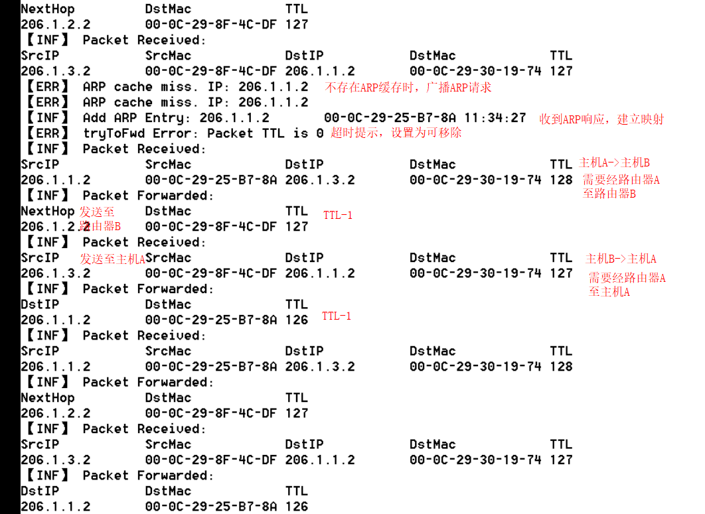

最终主机A和主机B能相互ping通

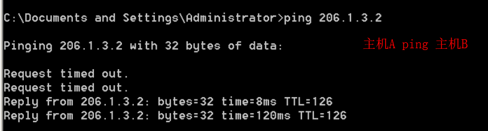

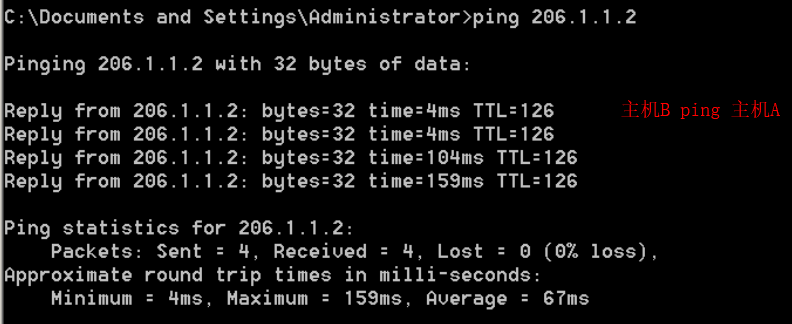

#### 指令输入线程

指令输入线程完成对地址表的手动维护和显示功能——对路由表的增删查和对ARP表的打印。通过使用`strtok`函数将输入指令按空格拆分，放入向量中，再对向量各元素进行检查，即可完成指令的解析。

```c++
void Router::cmdThrd() {
    ...
    char cmd[50];
    while (true) {
        cin.getline(cmd, 50);
        parseCmd(cmd);
    }
}

void Router::parseCmd(char* cmd) {
    char* p;
    vector<string> cmdVec;
    if(string(cmd) == "") {
        cout << "【CMD】 Command empty!" << endl;
        return;
    }
    p = strtok(cmd, " ");
    do {
        cmdVec.push_back(string(p));
    } while ((p = strtok(NULL, " ")) != NULL);
    if(cmdVec[0] == "route") {
        if(cmdVec[1] == "add") {
            routingTable->add(cmdVec[2].c_str(), cmdVec[4].c_str(), cmdVec[5].c_str());
        }
        if(cmdVec[1] == "delete") {
            if(cmdVec[2] == "0.0.0.0") {
                cout << "【ERR】 Cannot delete default route!" << endl;
                return;
            }
            routingTable->del(routingTable->lookup(inet_addr(cmdVec[2].c_str())));
        }
        if(cmdVec[1] == "change") {
            routingTable->del(routingTable->lookup(inet_addr(cmdVec[2].c_str())));
            routingTable->add(cmdVec[2].c_str(), cmdVec[4].c_str(), cmdVec[5].c_str());
        }
        if(cmdVec[1] == "print") {
            cout << routingTable->toStr() << endl;
        }
    }
    if(cmdVec[0] == "arp") {
        if(cmdVec[1] == "-a") {
            cout << arpTable->toStr() << endl;
        }
    }
}
```

## 特殊现象分析

### 处理组播/广播数据包——直接丢弃

使用wireshark捕获的数据包中，包含组播和广播的数据包。对于广播数据包，其以太网帧首部中目的mac地址为全1,；对于组播数组包，该目的mac地址第8位为1。如虚拟机使用的简单服务发现协议（SSDP）中的目的mac地址便为组播地址。

该实验中为了处理方便，仅对基于IP协议的单播数据包进行可能的转发操作，因此不考虑对基于组播/广播数据包的上层协议进行相应转发，直接丢弃，通过捕获数据包时限制目的mac地址为打开设备的mac地址进行过滤。

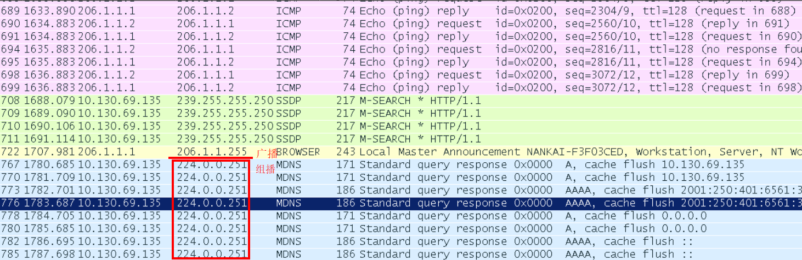

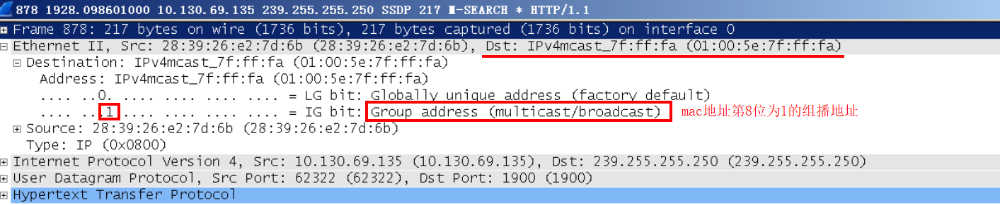

### 转发缓存的一致性问题

实验中需要对数据包缓存进行维护。对于接收线程，将过滤后的IP数据包加入缓冲区中；对于转发线程，转发IP数据包，并将应当弹出的数据包移出缓冲区。这样，就需要对缓冲区的一致性进行维护。设计如下：

1. 使用临界区（同一进程下，相较于互斥锁更轻量级）进行共享变量访问控制
2. 对缓冲区的起始位置进行加锁。转发线程将数据包加入起始位置之前，转发线程从起始位置之后遍历，这样共享变量只有缓冲区的其实位置，提高了并行度，减少了同步开销

问题为：使用vector进行维护时，任一线程对缓冲区的修改，将导致另一线程中维护的迭代器失效

原因为：vector类型为连续地址管理，无论在begin之前插入，还是使用push_back函数，都将使已确定的迭代器失效，在VS2022下进行调试，得到验证：

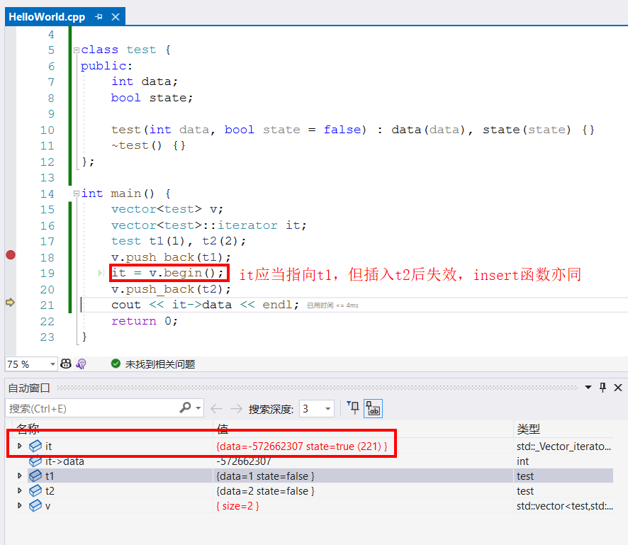

解决：使用自定义链表数据结构进行维护。

### IP地址与网络上的其他系统有冲突

如图所示，当主机A ping 主机B时，在路由器A处提示IP地址重复。且此时不能正确ping通。

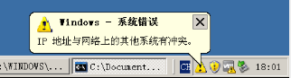

通过Wireshark抓包分析，注意到由主机B向主机A的响应报文，在从路由器B发往路由器A的过程中出现异常，目的mac地址应当为主机A的mac地址，而此时却为全0。因此想到为获取路由器B端口mac地址时，广播数据包中源IP地址为路由器A的IP地址，而源mac地址为全0。因此在路由器B接收到广播后，将源IP地址和源mac地址形成映射填入ARP缓存，而该映射中的mac地址为全0。造成了IP地址与mac地址映射的冲突


查看路由器B的ARP缓存表，验证了这一点

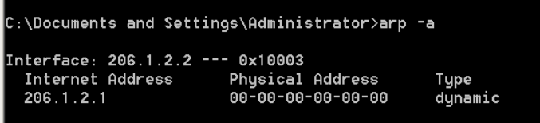

解决：在获取非本机mac地址时，将广播数据包中的源mac地址设置为本机mac地址，路由程序正常工作

## 参考资料

1. [Internet Control Message Protocol - Wikipedia](https://en.wikipedia.org/wiki/Internet_Control_Message_Protocol)